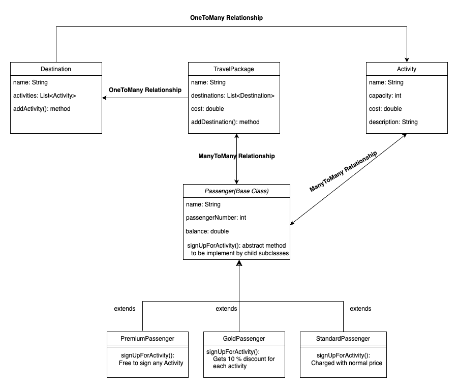

# Travel Booking Models High Level Design Overview

Below is the high-level design for a travel booking models. Following is an overview of the models, their relationships, and key operations within the system.

## Models

### Activity

The `Activity` model represents an individual activity that can be a part of a travel package or destination. It includes details such as:

- Name
- Capacity
- Cost
- Description

### Destination

The `Destination` model represents a travel destination, which can encompass multiple activities. It serves as a container for various activities available at a particular location.
- Name
- Activity

### Passenger (Abstract/Base Class)

The `Passenger` model is an abstract base class that defines the common attributes and behaviors of all passenger types, which may include:
- Name
- Passenger Number
- Balance

### StandardPassenger

The `StandardPassenger` class inherits from `Passenger` and represents a standard passenger with basic functionalities and no additional benefits.

### GoldPassenger

The `GoldPassenger` class, also inheriting from `Passenger`, represents a gold-tier passenger, offering benefits such as 10 % discounts on activities.

### PremiumPassenger

The `PremiumPassenger` class is also inheriting from `Passenger`, representing a premium-tier passenger with more benefits than a gold-tier passenger, offering free signup for activities for a passenger.

### TravelPackage

The `TravelPackage` model represents a collection of travel destinations and activities offered to passengers. It acts as a comprehensive travel plan that passengers can purchase.

## Relationships

### Destination to Activity

- One-to-Many: A single destination can include multiple activities.

### Passenger to Activity

- Many-to-Many (through TravelPackage or direct association): Passengers can sign up for multiple activities, and an activity can accommodate multiple passengers.

### TravelPackage to Destination

- One-to-Many: A travel package can encompass multiple destinations, allowing for diverse travel experiences.

### TravelPackage to Passenger

- Many-to-Many: A travel package can be purchased by multiple passengers, and a passenger can buy multiple travel packages, facilitating flexible travel planning.

## Key Operations

### Passenger.signUpForActivity(Activity)

This method allows a passenger to sign up for an activity. The implementation might vary based on the passenger type, such as applying discounts for `GoldPassenger` or absolute free for `PremiumPassenger`.

### Destination.addActivity(Activity)

This operation adds a new activity to a destination, expanding the available options for `Passengers`.

### TravelPackage.addDestination(Destination)

This method adds a new destination to a travel package, allowing for the creation of comprehensive travel experiences.

---

## Low-Level Design Diagram

Below is the Low-Level Design (LLD) diagram for the Travel Service Models, illustrating the detailed architectural and component interactions:




## Running Tests

To execute the tests for this travel booking system, you can use the following Maven command:

```bash
mvn clean test
```
